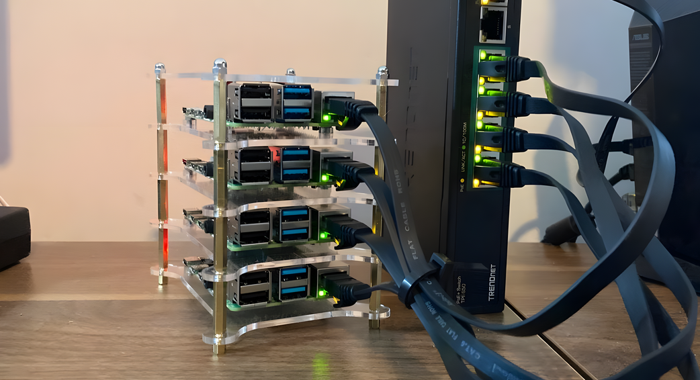

# Pi Homecluster K3s

Bem-vindo ao projeto Pi Homecluster K3s. Este repositório contém toda a automação necessária para provisionar e configurar um cluster Kubernetes (K3s) em placas Raspberry Pi, desde a gravação do sistema operacional no cartão SD até a inicialização completa do cluster.

A automação foi inteiramente projetada para transformar placas "limpas" em um cluster de laboratório pronto para receber suas aplicações.

## Pré-requisitos

| Ferramenta | Descrição |
| :--- | :--- |
| Sistema Operacional | Linux (testado em distribuições baseadas em Debian/Ubuntu) |
| Dependências Flashcard | `curl`, `xz`, `dd` instalados para gravar o sistema no SD |
| Ansible | Instalado na máquina host para executar os playbooks de configuração |
| Raspberry Pis | Placas Raspberry Pi com seus respectivos cartões SD e fonte de alimentação |

## Fluxo de Uso

O provisionamento do cluster é dividido em etapas sequenciais e lógicas. Abaixo está a ordem exata em que você deve executar os comandos e playbooks.

### 1. Gravação do Cartão SD

O primeiro passo é gravar a imagem do Debian no cartão SD e preencher configurações importantes, como IP, Gateway, DNS e Chave SSH. Insira o cartão SD no seu computador, garanta a permissão de execução e execute:

```bash
chmod +x flashcard.sh
./flashcard.sh
```

> [!IMPORTANT]
> **Execute o script SEM sudo.** O script solicitará a senha de administrador (`sudo`) internamente apenas para as etapas que realmente exigem privilégios (como `dd` e `mount`). Isso garante que suas variáveis de ambiente (como o caminho da sua Chave SSH) sejam lidas corretamente.

Siga os prompts interativos do script. Quando finalizado, insira o cartão na Raspberry Pi, conecte o cabo de rede e ligue a placa. 

Você também pode verificar o que seria configurado sem gravar nada usando o modo de simulação:

```bash
./flashcard.sh --dry-run
```

### 2. Configuração do Inventário

Edite o arquivo `inventory.yml` na raiz do projeto para refletir a topologia da sua rede.

| Node | Tipo | IP de Exemplo |
| :--- | :--- | :--- |
| `controlplane` | Control Plane | 192.168.18.240 |
| `worker01` | Worker Node | 192.168.18.242 |
| `worker02` | Worker Node | 192.168.18.244 |

Atualize os IPs na propriedade `ansible_host` de acordo com os IPs que você definiou usando o `flashcard.sh`.

### 3. Execução dos Playbooks

A partir deste momento toda a configuração é feita via Ansible. Acesse o diretório onde você clonou o projeto e execute os playbooks listados abaixo na ordem exata.

| Ordem | Playbook | Comando | Objetivo |
| :--- | :--- | :--- | :--- |
| **Passo 1** | `bootstrap.yml` | `ansible-playbook -i inventory.yml playbooks/bootstrap.yml` | Instala dependências básicas como Python3 via SSH diretamente usando o usuário root. |
| **Passo 2** | `nodes.yml` | `ansible-playbook -i inventory.yml playbooks/nodes.yml` | Instala utilitários, configura o hostname, gerencia cgroups, desabilita a swap e o WiFi, e cria o usuário `k3s`. Por questões de segurança, bloqueia permanentemente acessos via usuário root na rede. |
| **Passo 3** | `k3s.yml` | `ansible-playbook -i inventory.yml playbooks/k3s.yml` | Instala o K3s Server no plano de controle, e em seguida instala e associa os agentes (Workers). Finaliza validando a integridade da comunicação. |

**Dica de Validação:** O diretório `playbooks` possui scripts como `bootstrap-validate.sh`, `nodes-validate.sh` e `k3s-validate.sh` que podem ser executados após cada etapa para testar e garantir individualmente que o provisionamento ocorreu com sucesso em todos os nós.

VÍDEO NO ASCIINEMA: https://asciinema.org/a/YpwmFfDbT3wCRO3W

## Conclusão

Após a execução do último playbook, seu cluster estará pronto e operacional. Basta copiar o arquivo de conexão do control plane para a sua máquina ou utilizar a ferramenta `kubectl` diretamente a partir do nó principal para começar a orquestrar seus containers!

<br>
